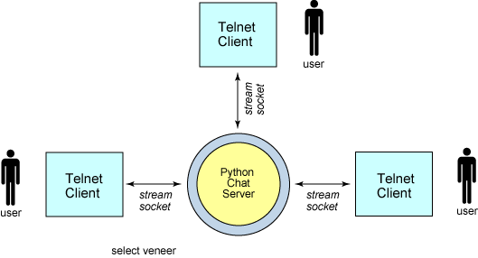
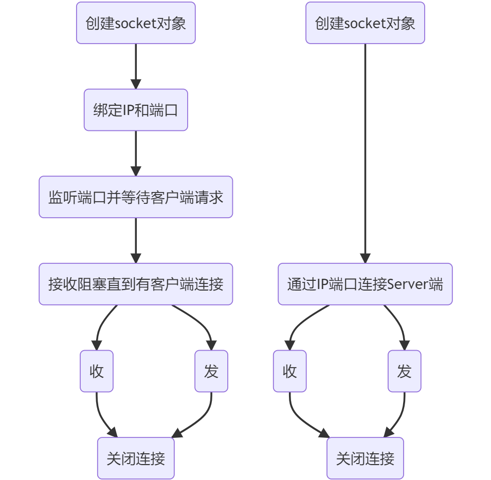
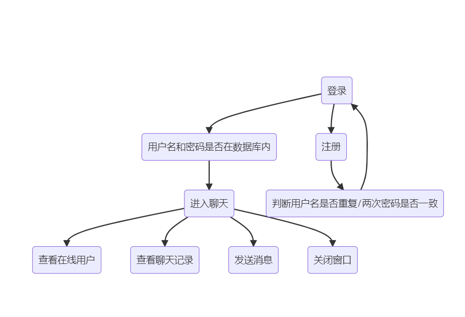
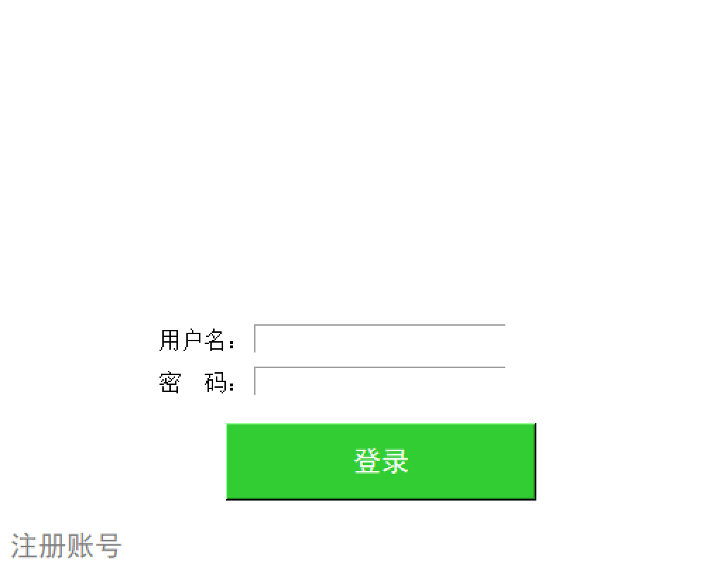
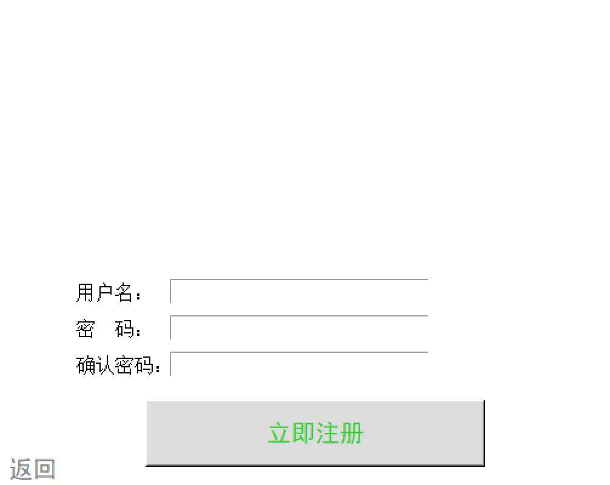
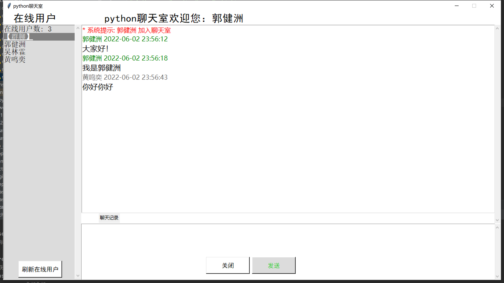
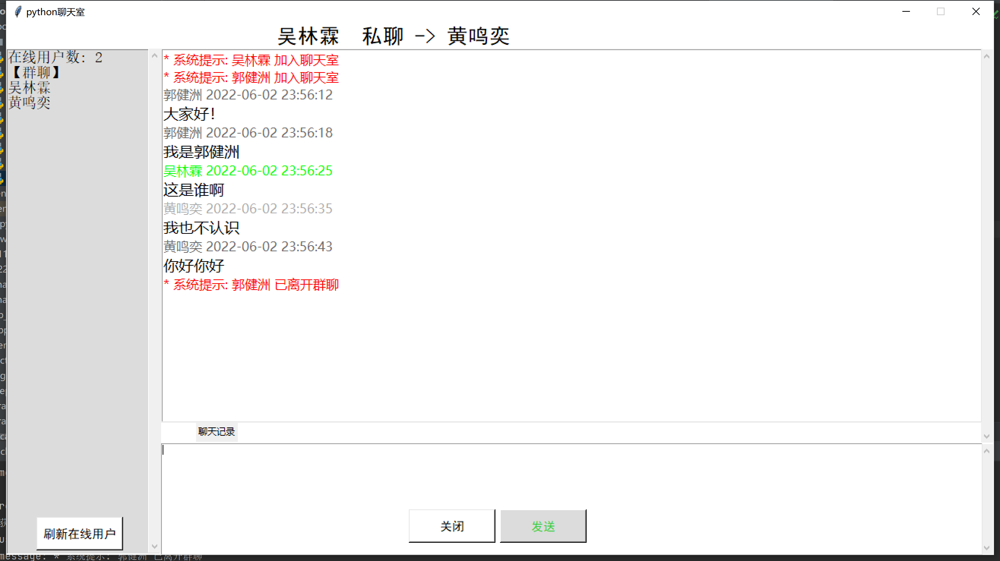
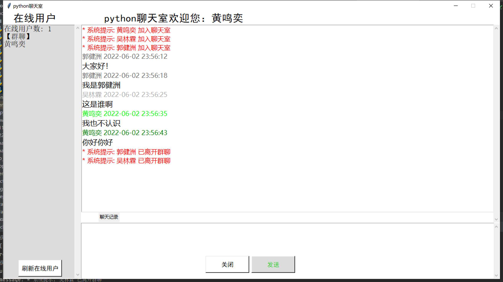
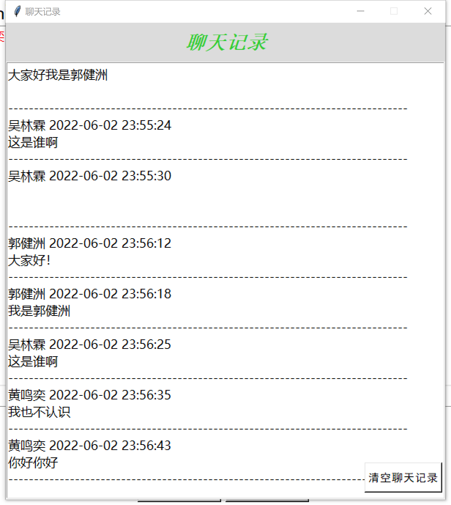

### 一、课设题目与要求
实现简单的聊天室，允许多个人同时一起聊天，每个人发送的消息所有人都能接收到，类似于 QQ 的群功能，而不是点对点的 QQ 好友之间的聊天。

### 二、解题分析
首先需要采用Tkinter建立登录和注册的页面并设计登录与注册系统，并将账号密码与MySQL进行关联。设计聊天界面，建立聊天服务器与用户客户端，使用套接字编程和多线程treading实现聊天室功能，并添加私聊，以及子窗口查看聊天记录的功能。
### 三、系统分析与设计
1. 系统总体设计与详细设计

$chat-mysql$ ：用数据库记录用户名和密码。 

$chat-panel$ ：将登录、注册、聊天界面分别分装成类，通过主函数，即客户端来调用，然后通过用户的操作进行调用相应的对象实例方法。

$chat-server$ ：当运行服务端模块时,会创建一个socket，绑定本机ip地址及端口进行监听客户端的请求连接，每接受一个socket的请求，就开启一个新的线程来接受请求消息的处理。

$chat-client$ ：将socket也封装成类给主函数进行调用，可将不同用户的信息进行封装。

$main$ ：主函数功能主要是创建相应界面对象，处理各个按钮事件。先创建chatsocket对象，同时连接服务器，再创建了登录界面对象显示界面。
1. 程序流程图

socket内部逻辑

聊天

### 四、软件测试
**登录界面：**

**注册界面：**

**聊天界面：**

### 六、总结

本次大作业首先采用Tkinter建立登录和注册的页面并设计登录与注册系统，并将账号密码与MySQL进行关联。设计聊天界面，建立聊天服务器与用户客户端，使用套接字编程和多线程treading实现聊天室功能，并实现聊天，私聊，打开子窗口查看已存储的聊天记录，以及刷新在线用户列表功能。
